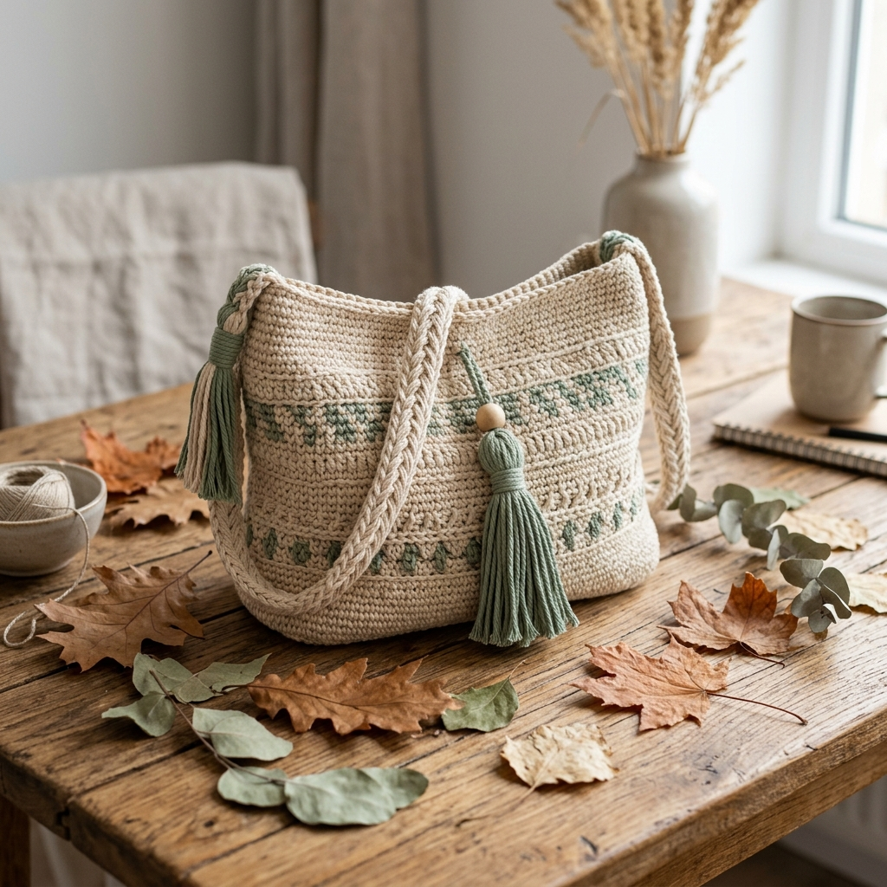

# Resultados del Proyecto: Minisitio Interactivo adidas Chile20 x Crochet

La plataforma ha sido completamente rediseñada y equipada para emular con precisión el minisitio interactivo **adidas – CHILE20 (adidaschile20.com)**, incluyendo su característica más importante: **el movimiento interactivo en 3D**.

---

## Archivos Finales del Proyecto

Todos los archivos del proyecto se localizan en:
[Carpeta del Proyecto](file:///C:/Users/USER/.gemini/antigravity-ide/scratch/prendas-tejidas-crochet/)

1. **[index.html](file:///C:/Users/USER/.gemini/antigravity-ide/scratch/prendas-tejidas-crochet/index.html)**:
   - Estructura inmersiva `#Stage` para el minisitio interactivo.
   - 3 Secciones de Mundos (Mundo 1: Polera Chile20, Mundo 2: Morral Shopper, Mundo 3: Propósito Social) con soporte 3D.
   - Puntos interactivos (*Hotspots*) con números para ver especificaciones de closeup.
   - Integración de controles de sonido ambiental.
   - Elemento flotante del **Ganchillo Dorado** de adiClub.
   - Sección de catálogo inferior oscura (`.dark-catalog`) con listado completo de productos y filtros.
2. **[style.css](file:///C:/Users/USER/.gemini/antigravity-ide/scratch/prendas-tejidas-crochet/style.css)**:
   - **Estética Cyberpunk:** Fondo negro absoluto (`#000000`), textos en blanco y acentos brillantes en Rojo Neón (`#FF1313`) y Verde Neón (`#00FF66`).
   - **Cero Bordes Redondeados (Regla Adidas):** Todos los botones e inputs de catálogo tienen bordes afilados y cuadrados.
   - **Soporte de Perspectiva 3D:** Se añadieron las propiedades `perspective: 1200px` y `transform-style: preserve-3d` a los contenedores y a las imágenes, permitiendo rotaciones espaciales reales.
3. **[app.js](file:///C:/Users/USER/.gemini/antigravity-ide/scratch/prendas-tejidas-crochet/app.js)**:
   - **Efecto Hover Parallax 3D (Desktop):** Al mover el mouse sobre la pantalla, la imagen se inclina de forma natural con un efecto de profundidad de capa.
   - **Movimiento de Rotación 3D (Click & Drag):** Al hacer clic y arrastrar (o deslizar el dedo en móviles), la imagen principal rota tridimensionalmente y los hotspots se desplazan a distinta velocidad, creando un efecto de profundidad de capas reales (Parallax 3D) idéntico a las chaquetas flotantes de `adidaschile20.com`.
   - **Retorno Suave:** Al soltar el clic, las imágenes regresan automáticamente a su posición central de manera amortiguada.
   - **Juego del Ganchillo Dorado:** Al encontrar y hacer clic en el ganchillo dorado que rota en la interfaz, se abre una modal de adiClub con el código `ADICLUB_CROCHET_15` que aplica automáticamente un **15% de descuento** en el carrito de compras.
   - **Sonido de Ambiente:** Permite reproducir/pausar una música lounge relajante mediante la API de Audio de HTML5.

---

## Capturas y Diseños Enlazados

- **Mundo 1 (Polera Crop adicolor):** 
- **Mundo 2 (Morral Shopper):** 
- **Mundo 3 (Propósito Social):** 

---

## Cómo Visualizar y Probar la Tienda
Haz clic en el siguiente enlace local para cargar el microsite inmersivo en tu navegador:

👉 **[Abrir adidas CHILE20 x Crochet](file:///C:/Users/USER/.gemini/antigravity-ide/scratch/prendas-tejidas-crochet/index.html)**
